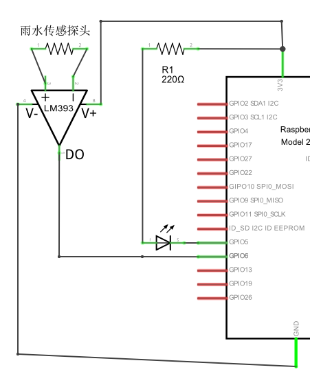

# rain_detection_win10iot
Rain detection sample running on Windows 10 IoT Core

我们需要检测雨水，自然需要一个检测雨水的雨水传感器和一个LED。根据第二模块所学的知识，在使用LED时一定要附加一个上拉电阻。所以，我们要使用的元器件如下：
a.	面包板一个
b.	LED一个
c.	220Ω上拉电阻一个
d.	（基于LM393的）雨水传感器一个
e.	杜邦线若干
根据代码，我们应当将传感器的DO口与开发板GPIO6相连，将LED负极与GPIO5相连。
在通电前，需要将传感器置于干燥环境。通电之后，LM393模块的电源指示亮起，工作指示灯灭。
然后将程序部署到IoT设备上进行调试。点击按钮，查看屏幕显示的状态和LED的亮灭情况。

